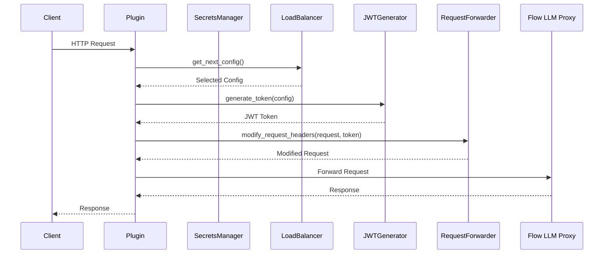
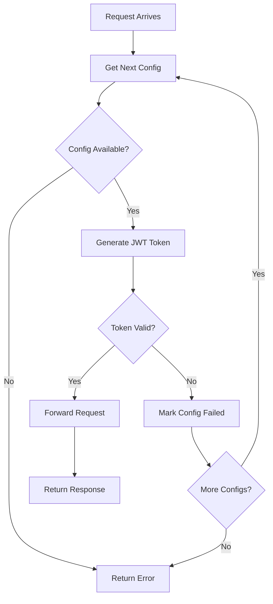

# Flow Proxy Plugin - 开发者指南

## 目录

- [架构概述](#架构概述)
- [核心组件](#核心组件)
- [API 文档](#api-文档)
- [开发环境设置](#开发环境设置)
- [代码质量工具](#代码质量工具)
- [测试指南](#测试指南)
- [扩展和自定义](#扩展和自定义)
- [贡献指南](#贡献指南)

## 架构概述

### 系统架构

```
┌─────────────────┐
│  Client App     │
└────────┬────────┘
         │ HTTP Request
         ▼
┌─────────────────────────────────────────────────┐
│         FlowProxyPlugin (proxy.py)              │
│  ┌──────────────────────────────────────────┐   │
│  │  1. SecretsManager                       │   │
│  │     - Load secrets.json                  │   │
│  │     - Validate configurations            │   │
│  └──────────────────────────────────────────┘   │
│  ┌──────────────────────────────────────────┐   │
│  │  2. LoadBalancer                         │   │
│  │     - Round-robin selection              │   │
│  │     - Failure tracking                   │   │
│  └──────────────────────────────────────────┘   │
│  ┌──────────────────────────────────────────┐   │
│  │  3. JWTGenerator                         │   │
│  │     - Generate JWT tokens                │   │
│  │     - Validate tokens                    │   │
│  └──────────────────────────────────────────┘   │
│  ┌──────────────────────────────────────────┐   │
│  │  4. RequestForwarder                     │   │
│  │     - Modify request headers             │   │
│  │     - Forward to Flow LLM Proxy          │   │
│  └──────────────────────────────────────────┘   │
└────────┬────────────────────────────────────────┘
         │ Authenticated Request
         ▼
┌─────────────────┐
│ Flow LLM Proxy  │
│ (flow.ciandt.   │
│  com)           │
└─────────────────┘
```

### 请求处理流程



### 负载均衡流程



## 核心组件

### 1. FlowProxyPlugin

主插件类，继承自 `HttpProxyBasePlugin`，协调所有组件。

**职责**:
- 初始化所有子组件
- 拦截和处理客户端请求
- 协调认证和转发流程
- 处理错误和日志记录

**关键方法**:
- `__init__()`: 初始化插件和所有组件
- `before_upstream_connection()`: 请求拦截和处理
- `handle_upstream_chunk()`: 响应数据处理

### 2. SecretsManager

管理 secrets.json 配置文件的加载和验证。

**职责**:
- 加载认证配置数组
- 验证 JSON 格式和必需字段
- 提供详细的错误信息

**关键方法**:
- `load_secrets(file_path)`: 加载配置文件
- `validate_secrets(secrets)`: 验证配置数组
- `validate_single_config(config)`: 验证单个配置

### 3. LoadBalancer

实现 Round-robin 负载均衡策略。

**职责**:
- 在多个配置之间轮询分配请求
- 跟踪失败的配置
- 自动故障转移
- 记录配置使用情况

**关键方法**:
- `get_next_config()`: 获取下一个配置
- `mark_config_failed(config)`: 标记配置失败
- `reset_failed_configs()`: 重置失败配置
- `log_config_usage(config)`: 记录配置使用

**状态管理**:
- `_available_configs`: 可用配置列表
- `_failed_configs`: 失败配置列表
- `_current_index`: 当前轮询索引
- `_total_requests`: 总请求计数

### 4. JWTGenerator

生成和验证 JWT 令牌。

**职责**:
- 根据配置生成 JWT 令牌
- 使用 HS256 算法签名
- 验证令牌格式和签名

**关键方法**:
- `generate_token(config)`: 生成 JWT 令牌
- `create_jwt_payload(config)`: 创建 JWT 载荷
- `validate_token(token, secret)`: 验证令牌

**JWT 结构**:
```python
# Header
{
    "alg": "HS256",
    "typ": "JWT"
}

# Payload
{
    "clientId": "...",
    "clientSecret": "...",
    "tenant": "..."
}
```

### 5. RequestForwarder

处理请求修改和转发。

**职责**:
- 修改请求头添加认证信息
- 构建目标 URL
- 处理响应数据
- 支持流式响应

**关键方法**:
- `modify_request_headers(request, jwt_token, config_name)`: 修改请求头
- `get_target_url(original_path)`: 获取目标 URL
- `handle_response_chunk(chunk)`: 处理响应数据
- `validate_request(request)`: 验证请求

## API 文档

### FlowProxyPlugin API

#### `__init__(*args, **kwargs)`

初始化插件实例。

**参数**:
- `*args`: 传递给父类的位置参数
- `**kwargs`: 传递给父类的关键字参数

**异常**:
- `FileNotFoundError`: secrets.json 文件不存在
- `ValueError`: 配置无效或为空

**示例**:
```python
plugin = FlowProxyPlugin()
```

#### `before_upstream_connection(request: HttpParser) -> HttpParser | None`

在建立上游连接前处理请求。

**参数**:
- `request`: 客户端 HTTP 请求

**返回**:
- `HttpParser`: 修改后的请求
- `None`: 拒绝请求

**处理流程**:
1. 验证请求
2. 选择认证配置
3. 生成 JWT 令牌
4. 修改请求头
5. 返回修改后的请求

**示例**:
```python
modified_request = plugin.before_upstream_connection(request)
if modified_request is None:
    # Request was rejected
    pass
```

#### `handle_upstream_chunk(chunk: memoryview) -> memoryview | None`

处理上游响应数据块。

**参数**:
- `chunk`: 响应数据块

**返回**:
- `memoryview`: 处理后的数据块
- `None`: 丢弃数据块

**特性**:
- 透明传递响应数据
- 支持流式响应
- 不缓冲数据

**示例**:
```python
processed_chunk = plugin.handle_upstream_chunk(chunk)
```

### SecretsManager API

#### `load_secrets(file_path: str) -> list[dict[str, str]]`

从文件加载认证配置数组。

**参数**:
- `file_path`: secrets.json 文件路径

**返回**:
- `list[dict[str, str]]`: 认证配置列表

**异常**:
- `FileNotFoundError`: 文件不存在
- `ValueError`: JSON 格式错误或验证失败

**示例**:
```python
manager = SecretsManager()
configs = manager.load_secrets("secrets.json")
```

#### `validate_secrets(secrets: list[dict[str, Any]]) -> bool`

验证配置数组完整性。

**参数**:
- `secrets`: 配置数组

**返回**:
- `bool`: 所有配置是否有效

**验证规则**:
- 必须是数组
- 不能为空
- 每个配置必须包含必需字段
- 字段值必须是非空字符串

**示例**:
```python
is_valid = manager.validate_secrets(configs)
```

### LoadBalancer API

#### `__init__(configs: list[dict[str, str]], logger: logging.Logger | None = None)`

初始化负载均衡器。

**参数**:
- `configs`: 认证配置列表
- `logger`: 可选的日志记录器

**异常**:
- `ValueError`: 配置列表为空

**示例**:
```python
balancer = LoadBalancer(configs, logger)
```

#### `get_next_config() -> dict[str, str]`

使用 Round-robin 策略获取下一个配置。

**返回**:
- `dict[str, str]`: 下一个可用配置

**异常**:
- `RuntimeError`: 没有可用配置

**行为**:
- 按顺序返回配置
- 到达末尾后循环到开始
- 自动跳过失败的配置
- 记录配置使用情况

**示例**:
```python
config = balancer.get_next_config()
```

#### `mark_config_failed(config: dict[str, str]) -> None`

标记配置失败并从可用列表移除。

**参数**:
- `config`: 失败的配置

**行为**:
- 从可用列表移除
- 添加到失败列表
- 调整当前索引
- 记录失败信息

**示例**:
```python
balancer.mark_config_failed(config)
```

#### `reset_failed_configs() -> None`

重置失败配置并恢复到可用列表。

**行为**:
- 将所有失败配置恢复
- 清空失败列表
- 重置索引
- 记录重置信息

**示例**:
```python
balancer.reset_failed_configs()
```

### JWTGenerator API

#### `generate_token(config: dict[str, str]) -> str`

根据配置生成 JWT 令牌。

**参数**:
- `config`: 包含 clientId、clientSecret 和 tenant 的配置

**返回**:
- `str`: 生成的 JWT 令牌

**异常**:
- `ValueError`: 配置无效或令牌生成失败

**示例**:
```python
generator = JWTGenerator(logger)
token = generator.generate_token(config)
```

#### `create_jwt_payload(config: dict[str, str]) -> dict[str, Any]`

创建 JWT 载荷。

**参数**:
- `config`: 认证配置

**返回**:
- `dict[str, Any]`: JWT 载荷字典

**载荷字段**:
- `clientId`: 客户端 ID
- `clientSecret`: 客户端密钥
- `tenant`: 租户 ID

**示例**:
```python
payload = generator.create_jwt_payload(config)
```

#### `validate_token(token: str, secret: str) -> bool`

验证 JWT 令牌。

**参数**:
- `token`: JWT 令牌字符串
- `secret`: 签名密钥

**返回**:
- `bool`: 令牌是否有效

**验证内容**:
- 签名有效性
- 必需字段存在
- 令牌格式正确

**示例**:
```python
is_valid = generator.validate_token(token, secret)
```

### RequestForwarder API

#### `modify_request_headers(request: HttpParser, jwt_token: str, config_name: str) -> HttpParser`

修改请求头添加认证信息。

**参数**:
- `request`: 原始 HTTP 请求
- `jwt_token`: JWT 令牌
- `config_name`: 配置名称（用于日志）

**返回**:
- `HttpParser`: 修改后的请求

**修改内容**:
- 添加 `Authorization: Bearer <token>` 头
- 修改 `Host` 头指向 Flow LLM Proxy
- 保留其他所有头部

**示例**:
```python
forwarder = RequestForwarder(logger)
modified = forwarder.modify_request_headers(request, token, "config1")
```

#### `get_target_url(original_path: str) -> str`

获取目标 Flow LLM Proxy URL。

**参数**:
- `original_path`: 原始请求路径

**返回**:
- `str`: 完整的目标 URL

**示例**:
```python
url = forwarder.get_target_url("/v1/models")
# Returns: "https://flow.ciandt.com/flow-llm-proxy/v1/models"
```

#### `handle_response_chunk(chunk: memoryview) -> memoryview`

处理响应数据块。

**参数**:
- `chunk`: 响应数据块

**返回**:
- `memoryview`: 处理后的数据块

**特性**:
- 透明传递
- 支持流式响应
- 不修改数据

**示例**:
```python
processed = forwarder.handle_response_chunk(chunk)
```

## 开发环境设置

### 前置要求

- Python 3.8+
- Poetry 1.2+
- Git

### 设置步骤

1. **克隆仓库**:
   ```bash
   git clone <repository-url>
   cd flow-proxy-plugin
   ```

2. **安装 Poetry**:
   ```bash
   curl -sSL https://install.python-poetry.org | python3 -
   ```

3. **安装依赖**:
   ```bash
   poetry install
   ```

4. **激活虚拟环境**:
   ```bash
   poetry shell
   ```

5. **安装 pre-commit hooks**:
   ```bash
   poetry run pre-commit install
   ```

6. **验证安装**:
   ```bash
   poetry run pytest
   poetry run mypy flow_proxy_plugin
   poetry run ruff check flow_proxy_plugin
   ```

### 项目结构

```
flow-proxy-plugin/
├── flow_proxy_plugin/          # 主包目录
│   ├── __init__.py            # 包初始化
│   ├── plugin.py              # 主插件类
│   ├── config.py              # 配置管理
│   ├── load_balancer.py       # 负载均衡器
│   ├── jwt_generator.py       # JWT 生成器
│   ├── request_forwarder.py   # 请求转发器
│   ├── error_handler.py       # 错误处理
│   ├── network_error_handler.py # 网络错误处理
│   └── cli.py                 # 命令行接口
├── tests/                      # 测试目录
│   ├── __init__.py
│   ├── conftest.py            # pytest 配置
│   ├── test_plugin.py         # 插件测试
│   ├── test_config.py         # 配置测试
│   ├── test_load_balancer.py  # 负载均衡测试
│   ├── test_jwt_generator.py  # JWT 测试
│   └── test_request_forwarder.py # 转发器测试
├── docs/                       # 文档目录
│   ├── USER_GUIDE.md          # 用户指南
│   └── DEVELOPER_GUIDE.md     # 开发者指南
├── pyproject.toml             # Poetry 配置
├── .pre-commit-config.yaml    # Pre-commit 配置
├── .pylintrc                  # Pylint 配置
├── secrets.json.template      # 配置模板
└── README.md                  # 项目说明
```

## 代码质量工具

### Ruff

快速的 Python linter 和格式化工具。

**运行 linting**:
```bash
poetry run ruff check flow_proxy_plugin
```

**自动修复**:
```bash
poetry run ruff check --fix flow_proxy_plugin
```

**格式化代码**:
```bash
poetry run ruff format flow_proxy_plugin
```

**配置** (pyproject.toml):
```toml
[tool.ruff]
line-length = 88
target-version = "py38"

[tool.ruff.lint]
select = ["E", "F", "I", "N", "W"]
ignore = []
```

### MyPy

静态类型检查工具。

**运行类型检查**:
```bash
poetry run mypy flow_proxy_plugin
```

**检查特定文件**:
```bash
poetry run mypy flow_proxy_plugin/plugin.py
```

**配置** (pyproject.toml):
```toml
[tool.mypy]
python_version = "3.8"
warn_return_any = true
warn_unused_configs = true
disallow_untyped_defs = true
```

### Pylint

代码质量分析工具。

**运行 Pylint**:
```bash
poetry run pylint flow_proxy_plugin
```

**生成报告**:
```bash
poetry run pylint flow_proxy_plugin --output-format=text > pylint_report.txt
```

**配置** (.pylintrc):
```ini
[MASTER]
max-line-length=88

[MESSAGES CONTROL]
disable=C0111,R0903
```

### Commitizen

规范化提交消息工具。

**创建提交**:
```bash
poetry run cz commit
```

**检查提交消息**:
```bash
poetry run cz check --commit-msg-file .git/COMMIT_EDITMSG
```

**生成变更日志**:
```bash
poetry run cz changelog
```

**提交类型**:
- `feat`: 新功能
- `fix`: 错误修复
- `docs`: 文档更新
- `style`: 代码格式
- `refactor`: 代码重构
- `test`: 测试相关
- `chore`: 构建/工具相关

**示例提交消息**:
```
feat(load_balancer): add configuration reset functionality

- Add reset_failed_configs method
- Update documentation
- Add unit tests

Closes #123
```

### Pre-commit Hooks

自动化代码质量检查。

**安装 hooks**:
```bash
poetry run pre-commit install
```

**手动运行**:
```bash
poetry run pre-commit run --all-files
```

**配置** (.pre-commit-config.yaml):
```yaml
repos:
  - repo: https://github.com/astral-sh/ruff-pre-commit
    rev: v0.1.6
    hooks:
      - id: ruff
        args: [--fix]
      - id: ruff-format

  - repo: https://github.com/pre-commit/mirrors-mypy
    rev: v1.7.1
    hooks:
      - id: mypy
        additional_dependencies: [types-all]

  - repo: local
    hooks:
      - id: pylint
        name: pylint
        entry: poetry run pylint
        language: system
        types: [python]
```

## 测试指南

### 测试框架

项目使用 pytest 作为测试框架。

### 运行测试

**运行所有测试**:
```bash
poetry run pytest
```

**运行特定测试文件**:
```bash
poetry run pytest tests/test_plugin.py
```

**运行特定测试**:
```bash
poetry run pytest tests/test_plugin.py::test_plugin_initialization
```

**带覆盖率报告**:
```bash
poetry run pytest --cov=flow_proxy_plugin --cov-report=html
```

**详细输出**:
```bash
poetry run pytest -v
```

**显示打印输出**:
```bash
poetry run pytest -s
```

### 测试结构

**单元测试**:
- 测试单个组件的功能
- 使用 mock 隔离依赖
- 快速执行

**集成测试**:
- 测试组件之间的交互
- 使用真实依赖
- 验证端到端流程

**属性测试**:
- 使用 Hypothesis 库
- 测试通用属性
- 大量随机输入

### 编写测试

**基本测试示例**:
```python
import pytest
from flow_proxy_plugin.config import SecretsManager

def test_load_valid_secrets():
    """Test loading valid secrets file."""
    manager = SecretsManager()
    configs = manager.load_secrets("tests/fixtures/valid_secrets.json")

    assert len(configs) == 2
    assert configs[0]["clientId"] == "test-client-1"

def test_load_invalid_secrets():
    """Test loading invalid secrets file."""
    manager = SecretsManager()

    with pytest.raises(ValueError):
        manager.load_secrets("tests/fixtures/invalid_secrets.json")
```

**使用 fixtures**:
```python
import pytest
from flow_proxy_plugin.load_balancer import LoadBalancer

@pytest.fixture
def sample_configs():
    """Provide sample configurations for testing."""
    return [
        {
            "name": "config1",
            "clientId": "client-1",
            "clientSecret": "secret-1",
            "tenant": "tenant-1"
        },
        {
            "name": "config2",
            "clientId": "client-2",
            "clientSecret": "secret-2",
            "tenant": "tenant-2"
        }
    ]

def test_round_robin(sample_configs):
    """Test round-robin load balancing."""
    balancer = LoadBalancer(sample_configs)

    config1 = balancer.get_next_config()
    config2 = balancer.get_next_config()
    config3 = balancer.get_next_config()

    assert config1["name"] == "config1"
    assert config2["name"] == "config2"
    assert config3["name"] == "config1"  # Cycles back
```

**使用 mock**:
```python
from unittest.mock import Mock, patch
from flow_proxy_plugin.plugin import FlowProxyPlugin

def test_plugin_with_mock():
    """Test plugin with mocked dependencies."""
    with patch('flow_proxy_plugin.plugin.SecretsManager') as mock_manager:
        mock_manager.return_value.load_secrets.return_value = [
            {"clientId": "test", "clientSecret": "test", "tenant": "test"}
        ]

        plugin = FlowProxyPlugin()
        assert plugin.configs is not None
```

### 测试覆盖率

**生成覆盖率报告**:
```bash
poetry run pytest --cov=flow_proxy_plugin --cov-report=html
```

**查看报告**:
```bash
open htmlcov/index.html
```

**目标覆盖率**: 80%+

## 扩展和自定义

### 添加新的负载均衡策略

1. **创建新的负载均衡器类**:

```python
from flow_proxy_plugin.load_balancer import LoadBalancer

class WeightedLoadBalancer(LoadBalancer):
    """Weighted load balancing strategy."""

    def __init__(self, configs, weights, logger=None):
        super().__init__(configs, logger)
        self.weights = weights
        self._weighted_configs = self._build_weighted_list()

    def _build_weighted_list(self):
        """Build weighted configuration list."""
        weighted = []
        for config, weight in zip(self._all_configs, self.weights):
            weighted.extend([config] * weight)
        return weighted

    def get_next_config(self):
        """Get next config using weighted strategy."""
        if not self._weighted_configs:
            raise RuntimeError("No available configurations")

        config = self._weighted_configs[self._current_index]
        self._current_index = (self._current_index + 1) % len(self._weighted_configs)
        self.log_config_usage(config)
        return config
```

2. **在插件中使用**:

```python
from flow_proxy_plugin.plugin import FlowProxyPlugin

class CustomFlowProxyPlugin(FlowProxyPlugin):
    def __init__(self, *args, **kwargs):
        super().__init__(*args, **kwargs)

        # Replace load balancer with weighted version
        weights = [3, 1]  # 3:1 ratio
        self.load_balancer = WeightedLoadBalancer(
            self.configs, weights, self.logger
        )
```

### 添加自定义错误处理

1. **创建错误处理器**:

```python
class CustomErrorHandler:
    """Custom error handling logic."""

    def __init__(self, logger):
        self.logger = logger

    def handle_auth_error(self, error, config):
        """Handle authentication errors."""
        self.logger.error(f"Auth error for {config['name']}: {error}")
        # Send alert, update metrics, etc.
        return self._create_error_response(401, "Authentication failed")

    def handle_network_error(self, error):
        """Handle network errors."""
        self.logger.error(f"Network error: {error}")
        return self._create_error_response(502, "Service unavailable")

    def _create_error_response(self, status_code, message):
        """Create error response."""
        return {
            "status": status_code,
            "error": message,
            "timestamp": datetime.now().isoformat()
        }
```

### 添加监控和指标

1. **创建指标收集器**:

```python
from prometheus_client import Counter, Histogram, Gauge

class MetricsCollector:
    """Collect and expose metrics."""

    def __init__(self):
        self.request_count = Counter(
            'flow_proxy_requests_total',
            'Total number of requests',
            ['config_name', 'status']
        )

        self.request_duration = Histogram(
            'flow_proxy_request_duration_seconds',
            'Request duration in seconds',
            ['config_name']
        )

        self.active_configs = Gauge(
            'flow_proxy_active_configs',
            'Number of active configurations'
        )

    def record_request(self, config_name, status, duration):
        """Record request metrics."""
        self.request_count.labels(
            config_name=config_name,
            status=status
        ).inc()

        self.request_duration.labels(
            config_name=config_name
        ).observe(duration)

    def update_active_configs(self, count):
        """Update active configuration count."""
        self.active_configs.set(count)
```

2. **集成到插件**:

```python
class MonitoredFlowProxyPlugin(FlowProxyPlugin):
    def __init__(self, *args, **kwargs):
        super().__init__(*args, **kwargs)
        self.metrics = MetricsCollector()

    def before_upstream_connection(self, request):
        start_time = time.time()

        try:
            result = super().before_upstream_connection(request)
            duration = time.time() - start_time

            config_name = self.load_balancer._get_config_name(
                self.load_balancer._available_configs[0]
            )
            self.metrics.record_request(config_name, "success", duration)

            return result
        except Exception as e:
            duration = time.time() - start_time
            self.metrics.record_request("unknown", "error", duration)
            raise
```

### 添加缓存层

1. **创建令牌缓存**:

```python
from datetime import datetime, timedelta
from typing import Optional

class TokenCache:
    """Cache JWT tokens to reduce generation overhead."""

    def __init__(self, ttl_seconds=3600):
        self.cache = {}
        self.ttl = timedelta(seconds=ttl_seconds)

    def get(self, config_id: str) -> Optional[str]:
        """Get cached token if valid."""
        if config_id in self.cache:
            token, expiry = self.cache[config_id]
            if datetime.now() < expiry:
                return token
            else:
                del self.cache[config_id]
        return None

    def set(self, config_id: str, token: str):
        """Cache token with expiry."""
        expiry = datetime.now() + self.ttl
        self.cache[config_id] = (token, expiry)

    def invalidate(self, config_id: str):
        """Invalidate cached token."""
        if config_id in self.cache:
            del self.cache[config_id]
```

2. **集成缓存**:

```python
class CachedJWTGenerator(JWTGenerator):
    def __init__(self, logger=None, cache_ttl=3600):
        super().__init__(logger)
        self.cache = TokenCache(cache_ttl)

    def generate_token(self, config):
        config_id = config.get("clientId")

        # Try to get from cache
        cached_token = self.cache.get(config_id)
        if cached_token:
            self.logger.debug(f"Using cached token for {config_id}")
            return cached_token

        # Generate new token
        token = super().generate_token(config)

        # Cache the token
        self.cache.set(config_id, token)

        return token
```

## 贡献指南

### 贡献流程

1. **Fork 仓库**
2. **创建功能分支**:
   ```bash
   git checkout -b feature/my-new-feature
   ```

3. **进行更改**:
   - 编写代码
   - 添加测试
   - 更新文档

4. **运行测试和检查**:
   ```bash
   poetry run pytest
   poetry run mypy flow_proxy_plugin
   poetry run ruff check flow_proxy_plugin
   poetry run pre-commit run --all-files
   ```

5. **提交更改**:
   ```bash
   poetry run cz commit
   ```

6. **推送到 Fork**:
   ```bash
   git push origin feature/my-new-feature
   ```

7. **创建 Pull Request**

### 代码规范

1. **遵循 PEP 8**: 使用 ruff 格式化代码
2. **类型注解**: 所有函数都应有类型注解
3. **文档字符串**: 使用 Google 风格的 docstrings
4. **测试覆盖**: 新代码应有 80%+ 的测试覆盖率
5. **提交消息**: 使用 Conventional Commits 规范

### 文档字符串示例

```python
def generate_token(self, config: dict[str, str]) -> str:
    """Generate JWT token based on authentication configuration.

    This method creates a JWT token using the HS256 algorithm and the
    provided authentication configuration. The token includes clientId,
    clientSecret, and tenant in the payload.

    Args:
        config: Authentication configuration containing:
            - clientId: Client identifier
            - clientSecret: Client secret for signing
            - tenant: Tenant identifier

    Returns:
        Generated JWT token as a string.

    Raises:
        ValueError: If configuration is invalid or token generation fails.

    Example:
        >>> generator = JWTGenerator()
        >>> config = {
        ...     "clientId": "test-client",
        ...     "clientSecret": "test-secret",
        ...     "tenant": "test-tenant"
        ... }
        >>> token = generator.generate_token(config)
        >>> isinstance(token, str)
        True
    """
    # Implementation...
```

### Pull Request 检查清单

在提交 PR 之前，确保：

- [ ] 所有测试通过
- [ ] 代码覆盖率 ≥ 80%
- [ ] 类型检查通过 (mypy)
- [ ] Linting 通过 (ruff, pylint)
- [ ] 文档已更新
- [ ] 提交消息符合规范
- [ ] 添加了必要的测试
- [ ] 代码有适当的注释
- [ ] 更新了 CHANGELOG (如适用)

### 发布流程

1. **更新版本号**:
   ```bash
   poetry run cz bump
   ```

2. **生成变更日志**:
   ```bash
   poetry run cz changelog
   ```

3. **创建 Git 标签**:
   ```bash
   git tag -a v1.0.0 -m "Release version 1.0.0"
   ```

4. **推送标签**:
   ```bash
   git push origin v1.0.0
   ```

5. **构建分发包**:
   ```bash
   poetry build
   ```

6. **发布到 PyPI** (如适用):
   ```bash
   poetry publish
   ```

## 调试技巧

### 使用 Python 调试器

```python
import pdb

def before_upstream_connection(self, request):
    # Set breakpoint
    pdb.set_trace()

    # Your code here
    config = self.load_balancer.get_next_config()
    # ...
```

### 使用日志调试

```python
self.logger.debug(f"Request: {request.method} {request.path}")
self.logger.debug(f"Headers: {request.headers}")
self.logger.debug(f"Config: {config}")
```

### 使用 pytest 调试

```bash
# 在第一个失败处停止
poetry run pytest -x

# 进入 pdb 调试器
poetry run pytest --pdb

# 显示局部变量
poetry run pytest -l
```

## 性能优化

### 分析性能

使用 cProfile 分析性能：

```bash
python -m cProfile -o profile.stats -m flow_proxy_plugin.cli
```

查看结果：

```python
import pstats
p = pstats.Stats('profile.stats')
p.sort_stats('cumulative')
p.print_stats(20)
```

### 优化建议

1. **缓存 JWT 令牌**: 减少令牌生成开销
2. **使用连接池**: 复用 HTTP 连接
3. **异步处理**: 使用 asyncio 处理并发请求
4. **减少日志**: 在生产环境使用 WARNING 级别

## 常见问题

### Q: 如何添加新的配置字段？

A: 在 `SecretsManager.validate_single_config()` 中添加验证逻辑，并更新文档。

### Q: 如何更改负载均衡策略？

A: 继承 `LoadBalancer` 类并重写 `get_next_config()` 方法。

### Q: 如何添加自定义日志格式？

A: 在 `cli.py` 中配置 logging 格式。

### Q: 如何处理新的错误类型？

A: 在 `error_handler.py` 中添加新的错误处理方法。

## 资源链接

- [proxy.py 文档](https://github.com/abhinavsingh/proxy.py)
- [PyJWT 文档](https://pyjwt.readthedocs.io/)
- [Poetry 文档](https://python-poetry.org/docs/)
- [pytest 文档](https://docs.pytest.org/)
- [Ruff 文档](https://docs.astral.sh/ruff/)
- [MyPy 文档](https://mypy.readthedocs.io/)

## 联系方式

如有问题或建议，请：
- 提交 GitHub Issue
- 发送 Pull Request
- 查阅项目文档

相关文档：
- [用户指南](USER_GUIDE.md)
- [详细使用手册](USAGE_MANUAL.md)
- [配置指南](CONFIG.md)
- [部署指南](DEPLOYMENT.md)

---

**最后更新**: 2024-01-15
